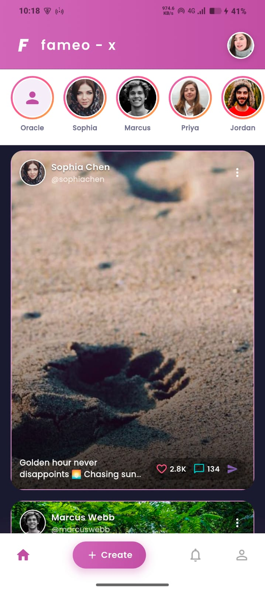
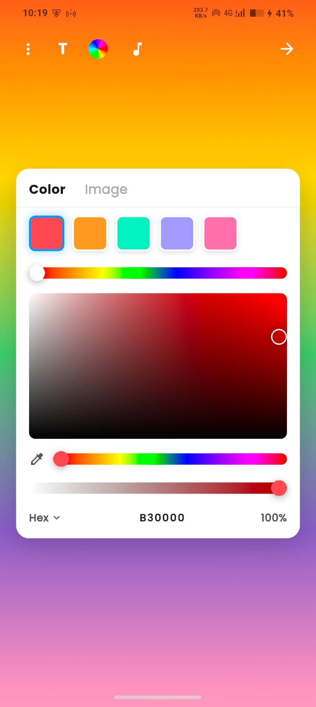
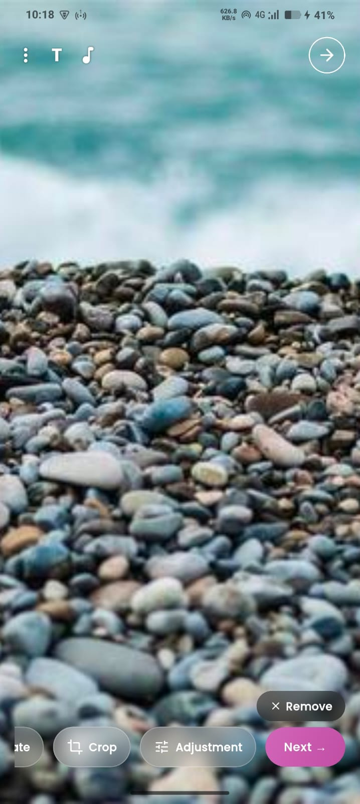
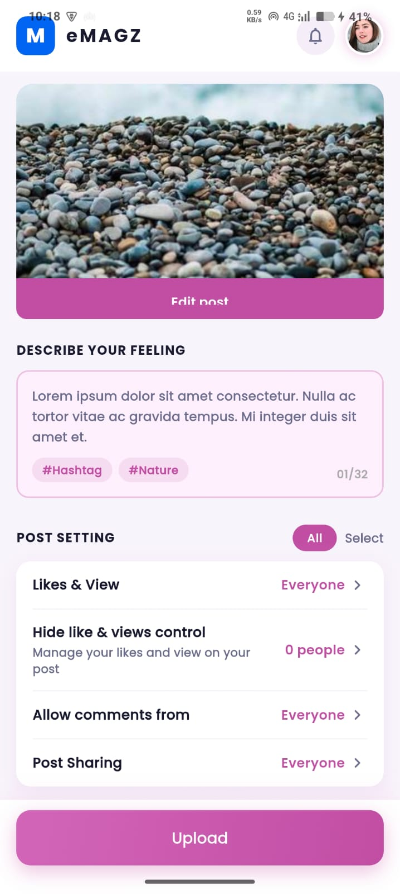
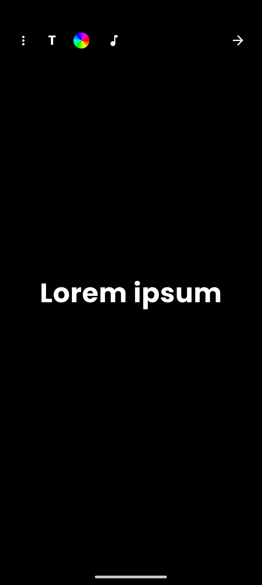
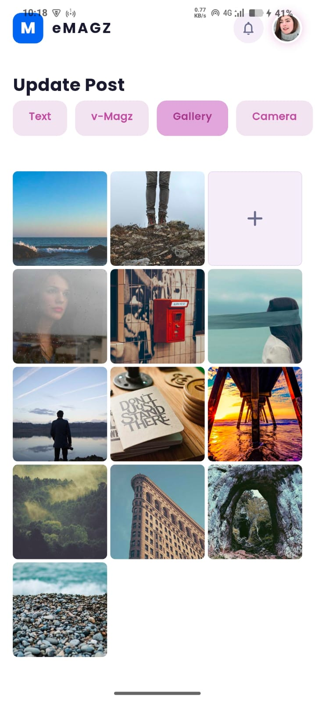

# eMAGZ - Flutter Social Media UI Assignment

A modern social media Flutter application built as part of an internship assignment.

The project focuses on:
- Pixel-perfect UI implementation
- Responsive layouts
- MVC architecture
- GetX state management
- Local storage integration
- Modern social media editing workflow

---

# ✨ Features

## 📱 Social Feed UI
- Modern social media feed
- Story section
- Responsive post cards
- Interactive bottom navigation

## 🖼️ Gallery & Post Creation
- Image grid selection
- Upload workflow
- Edit post flow
- Responsive image preview

## 🎨 Story/Text Editor
- Fullscreen text editor
- Gradient background editor
- Color selection UI
- Modern editing controls

## ⚙️ Post Settings
- Audience settings
- Like/view controls
- Comment settings
- Upload workflow

## 💾 Local Storage
- Persistent local storage using GetStorage
- Saved post data
- Local UI state management

---

# 🛠️ Tech Stack

- Flutter
- Dart
- GetX
- GetStorage
- MVC Architecture
- flutter_staggered_grid_view
- image_picker
- google_fonts

---

# 📂 Project Structure

```bash
lib/
 ├── app/
 │   ├── routes/
 │   ├── theme/
 │   └── services/
 │
 ├── models/
 │
 ├── controllers/
 │
 ├── views/
 │
 ├── widgets/
 │
 └── utils/
📸 Screenshots
🏠 Home Feed Screen
<p align="center">  </p>
🎨 Color Picker Screen
<p align="center">  </p>
🖼️ Image Editor Screen
<p align="center">  </p>
⚙️ Post Settings Screen
<p align="center">  </p>
✍️ Text Editor Screen
<p align="center">  </p>
📤 Upload Screen
<p align="center">  </p>
🚀 Getting Started
Prerequisites
Flutter SDK
Android Studio / VS Code
Dart SDK
Android Emulator or Physical Device
⚡ Installation
1. Clone Repository
git clone <your_repository_link>
2. Navigate to Project
cd emagz_assignment
3. Install Dependencies
flutter pub get
4. Run Application
flutter run
📦 Build APK
flutter build apk --release

APK location:

build/app/outputs/flutter-apk/app-release.apk
📱 Responsive Design

The application is fully responsive and optimized for:

Android phones
Different screen sizes
Portrait layouts
Modern mobile UI scaling
🧠 Architecture

The project follows MVC Architecture with GetX:

Models → Data structure
Views → UI Screens
Controllers → Business logic and state management
Widgets → Reusable UI components
Services → Local storage and helper methods
📌 Assignment Requirements Covered

✅ Responsive UI

✅ Pixel-perfect design

✅ MVC architecture

✅ GetX state management

✅ Local storage support

✅ Reusable widgets

✅ Clean folder structure

✅ Screen recording demo

✅ APK build

👨‍💻 Author

Abdu Fakir

Flutter Developer


LinkedIn: https://www.linkedin.com/in/abdurehaman-fakir

📃 License

This project was developed for internship assignment and educational purposes.