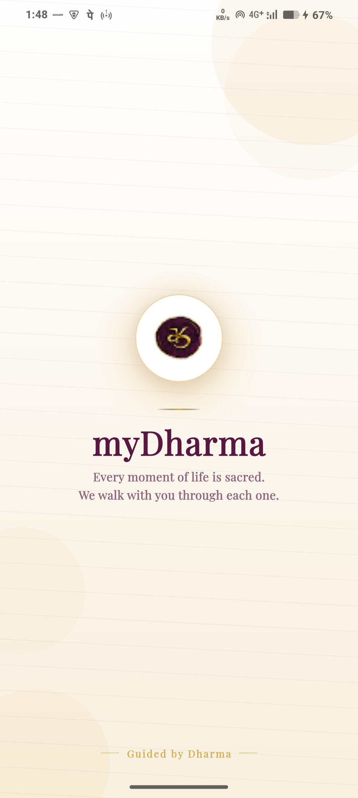
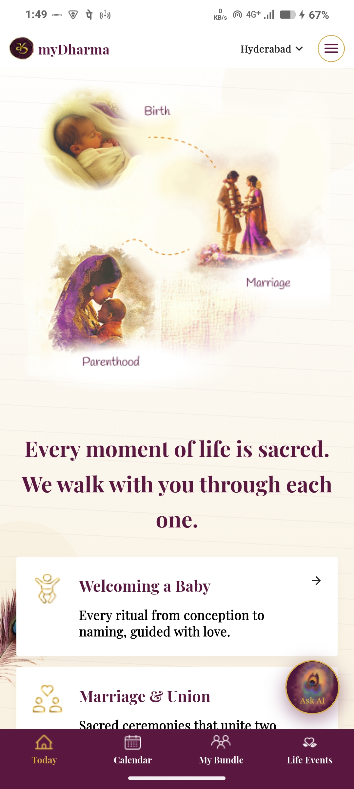
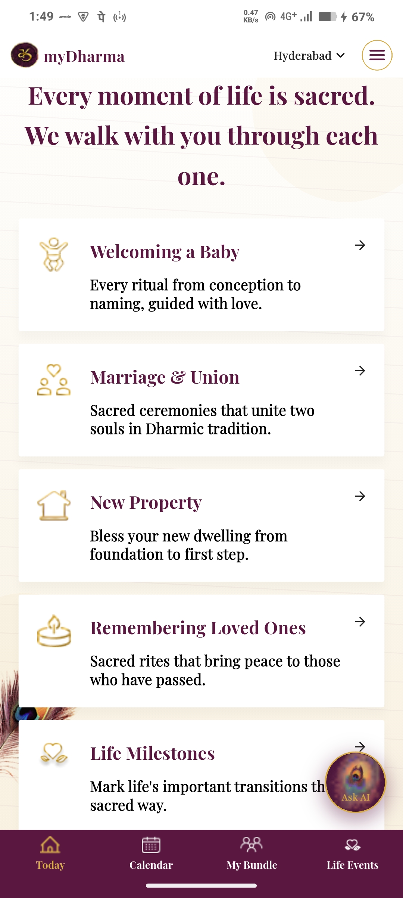
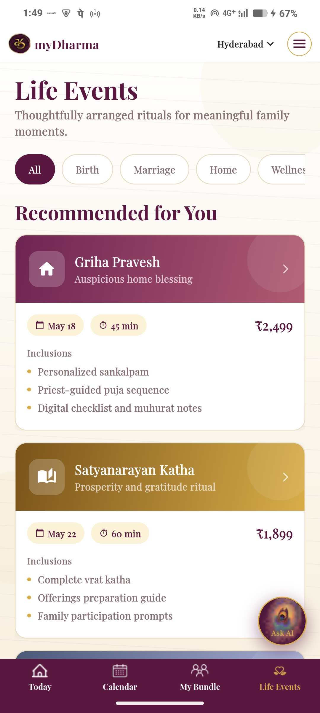
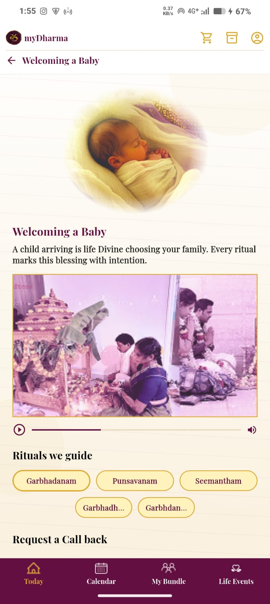
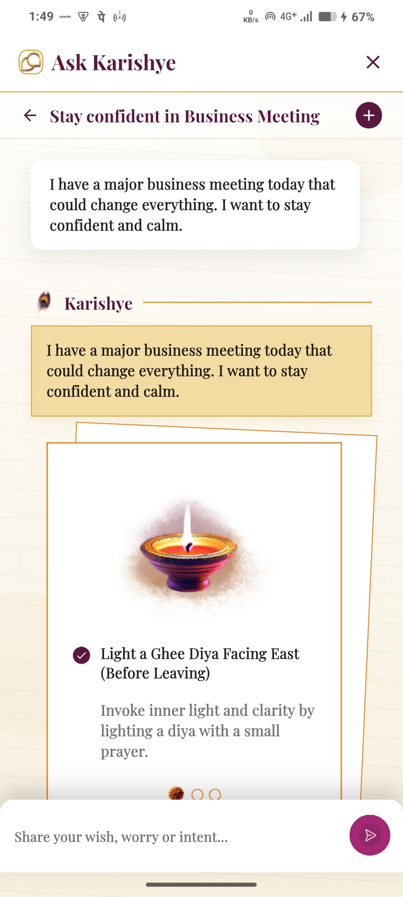
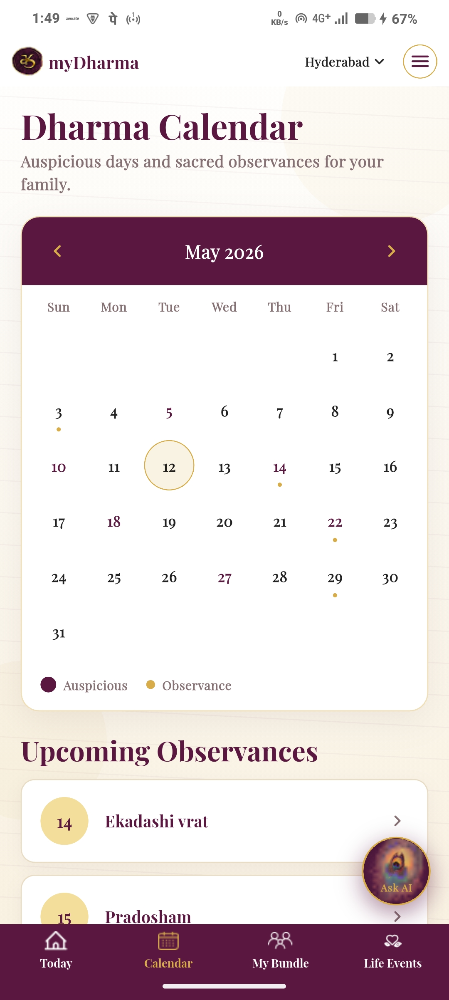
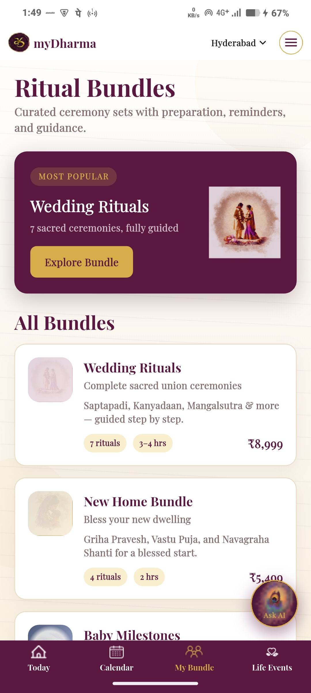

# 🕉️ myDharma — Spiritual Life Journey App

A beautifully crafted Flutter application designed to guide users through meaningful spiritual and life events with elegance, simplicity, and modern mobile experiences.

myDharma helps users explore rituals, life milestones, spiritual guidance, and personalized experiences through a calm and premium UI inspired by traditional Indian aesthetics.

---

# ✨ Features

* 🌸 Elegant spiritual themed UI
* 📱 Fully responsive Flutter application
* 🧭 Bottom navigation architecture
* 🕯️ AI Spiritual Assistant — Ask Karishye
* 📅 Calendar & activity tracking
* 🎉 Life events exploration
* 🎨 Pixel-perfect Figma implementation
* 🏛️ MVC architecture
* ⚡ Smooth animations and transitions
* 📦 Clean reusable widget system
* 🌙 Premium Playfair Display typography

---

# 🧱 Tech Stack

* Flutter
* Dart
* MVC Architecture
* flutter_screenutil
* Google Fonts
* Material 3

---

# 📂 Project Structure

```bash
lib/
│
├── core/
│   ├── constants/
│   ├── theme/
│   ├── widgets/
│   └── utils/
│
├── controllers/
│
├── models/
│
├── views/
│   ├── splash/
│   ├── home/
│   ├── today/
│   ├── life_events/
│   ├── event_details/
│   ├── ai_chat/
│   ├── calendar/
│   └── my_bundle/
│
├── services/
│
└── main.dart
```

---

# 🎨 Design System

## Typography

* Playfair Display

## Primary Colors

| Usage             | Color                 |
| ----------------- | --------------------- |
| Primary Text      | `rgba(90, 23, 64, 1)` |
| Accent Gold       | Gold                  |
| Background        | Warm Beige / Cream    |
| Scaffold Gradient | White → Transparent   |

---

# 📱 Screens

The application currently contains 8 screens:

1. Splash Screen
2. Home Screen
3. Today Screen
4. Life Events Screen
5. Event Details Screen
6. Ask Karishye Chat Screen
7. Calendar Screen
8. My Bundle Screen

---

# 🖼️ App Screenshots

## Splash Screen




---

## Home Screen




---

## Today Screen




---

## Life Events Screen




---

## Event Details Screen




---

## Ask Karishye Chat Screen




---

## Calendar Screen




---

## My Bundle Screen




---

# 🚀 Getting Started

## Prerequisites

* Flutter SDK
* Android Studio / VS Code
* Dart SDK

---

## Installation

Clone the repository:

```bash
git clone <your-repository-link>
```

Navigate into project:

```bash
cd mydharma
```

Install dependencies:

```bash
flutter pub get
```

Run the app:

```bash
flutter run
```

---

# 📦 APK Download

Download the APK here:

[Google Drive APK Link](https://drive.google.com/drive/folders/1XwGW_er6tf0ZCbpH1uewEE_dvm-zMv4D?usp=sharing)

---

# 📱 Responsive Design

The application is fully responsive and optimized for:

* Android devices
* iPhone devices
* Multiple screen sizes
* Tablets

---

# 🧠 Architecture

This project follows MVC architecture:

* Models → App data structure
* Views → UI screens/widgets
* Controllers → Business & state logic

---

# 🔮 Future Improvements

* Firebase backend integration
* Authentication
* Real-time AI assistant
* Ritual booking APIs
* Push notifications
* Dark mode support
* Multi-language support

---

# 👨‍💻 Developer

Developed with Flutter using modern UI/UX practices and clean architecture principles.

---

# 📜 License

This project is developed for assessment and educational purposes.
