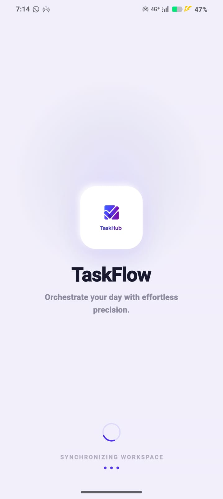
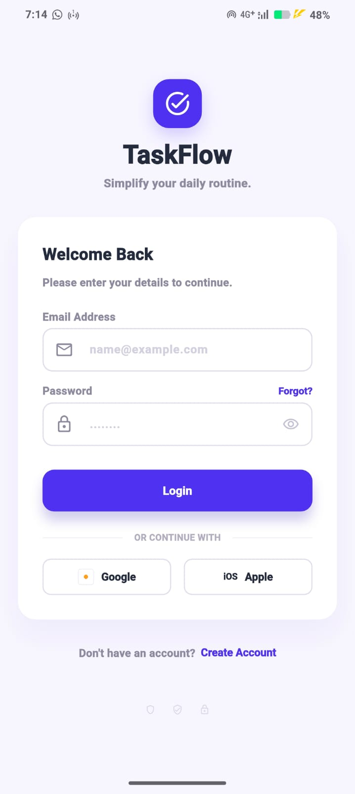
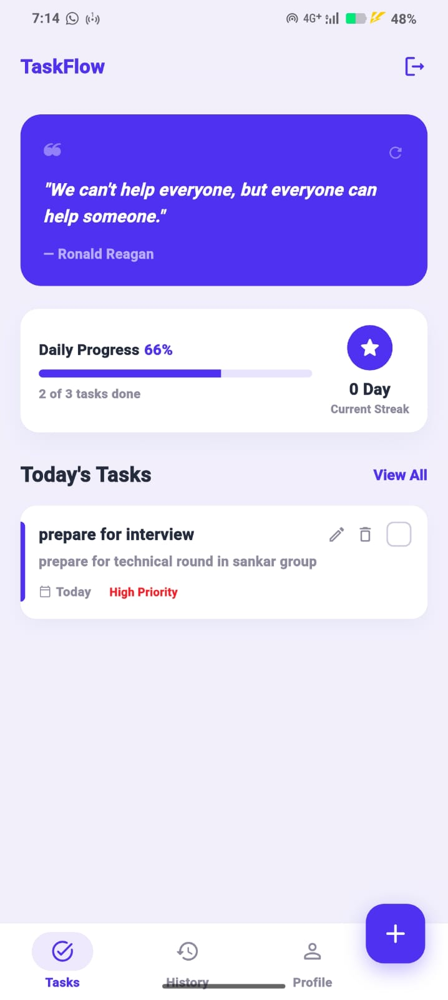
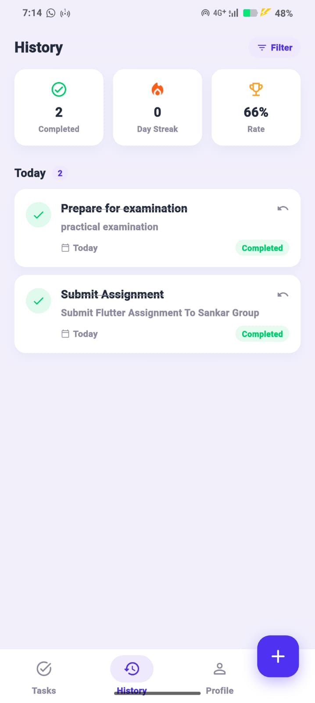
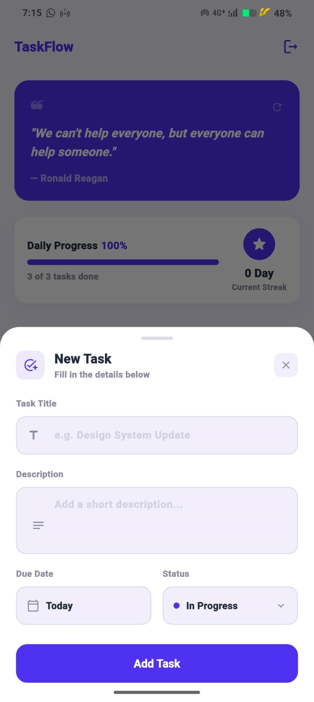
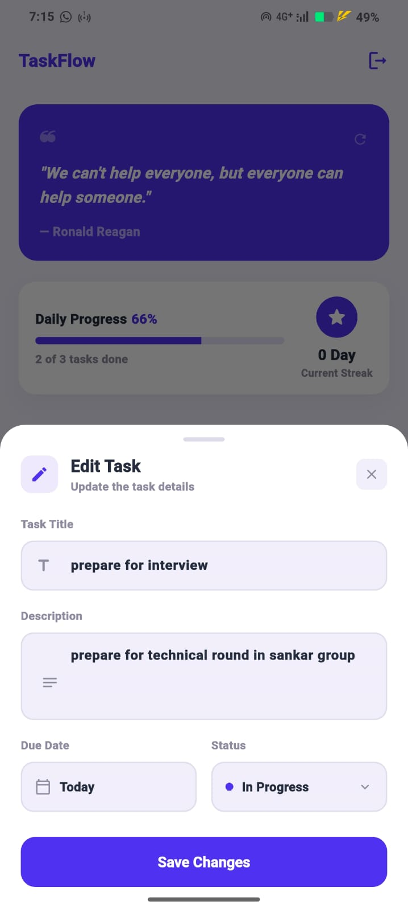
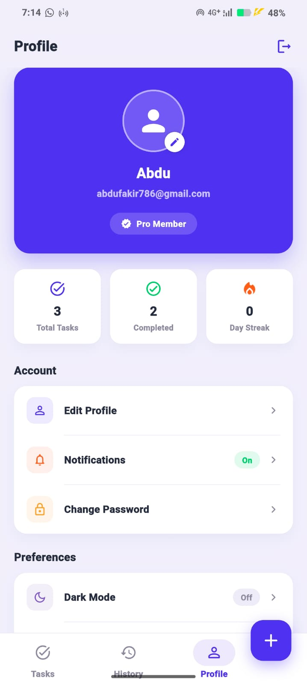

# Task Manager App

A modern Flutter Task Manager application built using **Flutter**, **Firebase**, and **GetX** featuring real-time task management, authentication, streak tracking, motivational quotes, and a clean responsive UI.

---

# Features

## Authentication

* Firebase Email/Password Authentication
* Persistent login using SharedPreferences
* Auto-login and logout functionality

## Task Management

* Add, edit, delete, and complete tasks
* Task statuses:

  * In Progress
  * Completed
  * High Priority
* Real-time Firestore task updates
* User-specific task storage

## Daily Progress & Streaks

* Live task completion progress
* Daily streak tracking
* Milestone celebration snackbars

## History

* Completed tasks grouped by date
* Undo completed tasks
* Completion statistics and streak overview

## Motivational Quotes

* Random quotes fetched from ZenQuotes API
* Refresh quotes with loading and retry states

## Profile

* User profile and task statistics
* Settings and logout functionality

## Navigation & UI

* Shared bottom navigation with persistent tabs
* Floating Action Button for quick task creation
* Animated splash screen and modern Material 3 UI

---

# Architecture

* GetX for:

  * State management
  * Navigation
  * Dependency injection
* Clean architecture using:

  * Controllers
  * Services
  * Models
  * Reusable Widgets
* Firestore-based cloud storage with secure user-scoped data

---

# Tech Stack

* Flutter & Dart
* Firebase Authentication
* Cloud Firestore
* GetX
* SharedPreferences
* ZenQuotes API

---

# Screenshots

## Splash Screen



## Login Screen



## Home Screen



## History Screen



## Add Task Screen



## Edit Task Screen



## Profile Screen



---

# APK & Demo Video

[Google Drive](https://drive.google.com/drive/folders/1_Va2FCLhBmtDgijICXDc6Wvia9gMSKBd?usp=sharing)

---

# Setup Instructions

## 1. Clone Repository

```bash
git clone https://github.com/AbduFakir/Flutter-Assignment-.git
```

## 2. Install Dependencies

```bash
flutter pub get
```

## 3. Configure Firebase

Add:

```text
google-services.json
```

inside:

```text
android/app/
```

## 4. Run Application

```bash
flutter run
```

---

# Author

**Abdurehaman Fakir**
